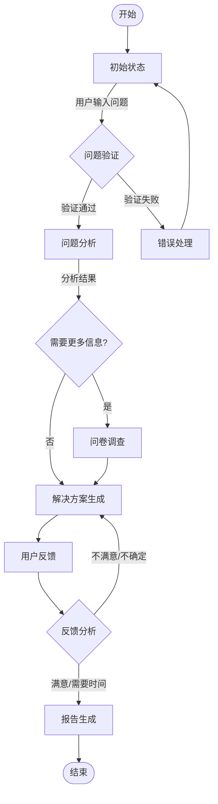

# 心理咨询系统流程文档

## 系统流程图

## 状态说明

### 1. 初始状态 (Initial)
- 系统等待用户输入问题
- 初始化会话上下文

### 2. 问题验证 (InputValidation)
- 验证用户输入的合法性
- 检查问题的基本结构和内容
- 确保问题符合系统处理能力

### 3. 问题分析 (ProblemAnalysis)
- 分析用户问题的具体内容
- 提取关键信息和主题
- 评估是否需要更多信息

### 4. 问卷调查 (Questionnaire)
- 根据缺失信息生成针对性问题
- 收集用户补充信息
- 完善问题理解

### 5. 解决方案生成 (SolutionGeneration)
- 基于完整信息生成解决方案
- 考虑用户具体情况
- 提供个性化建议

### 6. 用户反馈 (Feedback)
- 收集用户对解决方案的反馈
- 分析反馈类型（满意/不满意/不确定/需要时间）
- 决定后续流程

### 7. 报告生成 (Report)
- 总结咨询过程
- 记录关键信息和建议
- 生成完整咨询报告

## 状态转换规则

1. **初始 -> 问题分析**
   - 触发条件：用户输入有效问题
   - 验证通过后自动转换

2. **问题分析 -> 问卷/解决方案**
   - 根据信息完整性决定
   - 缺失关键信息时进入问卷
   - 信息完整时直接生成解决方案

3. **问卷 -> 解决方案**
   - 收集足够信息后自动转换
   - 用户可以选择跳过部分问题

4. **解决方案 -> 反馈**
   - 生成解决方案后等待用户反馈
   - 记录用户对方案的评价

5. **反馈 -> 解决方案/报告**
   - 不满意/不确定：返回解决方案生成
   - 满意/需要时间：进入报告生成

## 错误处理

1. **输入验证失败**
   - 返回友好错误提示
   - 允许用户重新输入

2. **分析过程异常**
   - 记录错误日志
   - 提供备选响应
   - 允许重试或人工介入

3. **状态转换异常**
   - 保持会话状态一致性
   - 提供恢复机制

## 注意事项

1. **隐私保护**
   - 所有用户信息严格加密
   - 定期清理敏感数据
   - 遵守数据保护规范

2. **会话管理**
   - 维护会话状态
   - 定期保存会话进度
   - 支持会话恢复

3. **系统监控**
   - 记录关键操作日志
   - 监控系统性能
   - 异常情况报警
